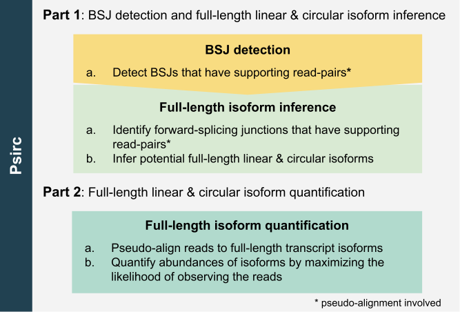
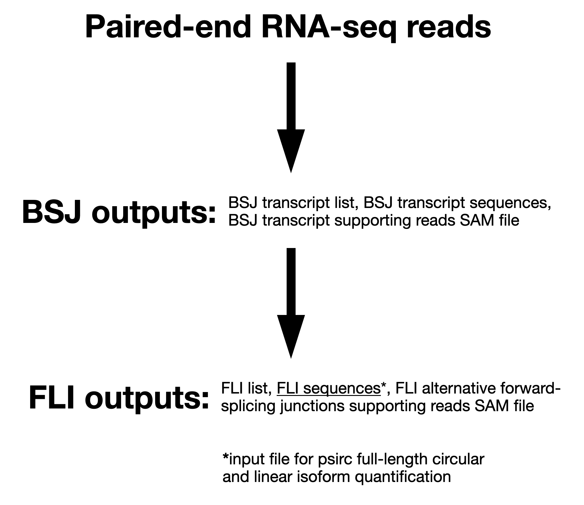

# psirc
Psirc (<ins>ps</ins>eudo-alignment identification of c<ins>irc</ins>ular RNAs) is for back-splicing junction detection, full-length linear and circular transcript isoform inference and quantification from RNA-seq data.

The whole psirc pipeline has two main parts: 1. Detecting <ins>b</ins>ack-<ins>s</ins>plicing <ins>j</ins>unctions (BSJs) and inferring <ins>f</ins>ull-<ins>l</ins>ength <ins>i</ins>soforms (FLIs); and 2. Quantification of FLIs (both linear and circular FLIs at the same time). Each part works well stand-alone, but it is recommended to use them together.

<p align="center" width="100%">
  
</p>

If you use psirc in your study, please cite(under review, online version can be found on bioRxiv): \
Ken Hung-On Yu\*, Christina Huan Shi\*, Bo Wang, Savio Ho-Chit Chow, Grace Tin-Yun Chung, Ke-En Tan, Yat-Yuen Lim, Anna Chi-Man Tsang, Kwok-Wai Lo, Kevin Y. Yip. Quantifying full-length circular RNAs in cancer. Genome Research 31.12 (2021): 2340-2353. Available from: https://genome.cshlp.org/content/31/12/2340.short

## Table of Contents

<!--  -->

- [External libraries](#library)
- [Installation](#install)
- [Requirements](#require)
- [Synopsis of requirements](#synop_require)
- [General usages](#gen_usages)
- [Synopsis of outputs](#synop_outs)
- [Generation of custom_transcriptome_fa](#gen_cust_fa)
- [Details of the FLI sequences output](#fli_out)
- [Details of the psirc-quant output](#quant_out)
- [References](#ref)
- [License](#license)

## <a name="library"></a>External libraries
- **zlib**
- **HDF5 C libraries**

## <a name="install"></a>Installation
The first part of psirc was implemented with Perl script, which can be run directly. The second part of psirc was implemented with C and C++.
```
    git clone https://github.com/Christina-hshi/psirc.git
    cd psirc
    cd psirc-quant
    #you may need to compile htslib under "ext/htslib" by following the README there ("make install" is optional)
    mkdir release
    cd release
    cmake ..
    make psirc-quant
    #the psirc-quant program can be found at "src/psirc-quant"
    make install (optional)
```

## <a name="require"></a>Requirements

* Input: paired-end RNA-seq reads
* [custom_transcriptome_fa][custom_transcriptome_fa]
* Forked kallisto<sup>[1](#ref)</sup>: [Linux] or [Mac] executable

## <a name="synop_require"></a>Synopsis of requirements
The __psirc__ pipeline has two parts. The first part is the [psirc script (for detecting BSJs and inferring FLIs), currently psirc_v1.0.pl] which is a Perl script that fully automates the production of the BSJ detection and FLI inference outputs from the above requirements. The second part is __psirc-quant__ which quantifies the abundances of FLIs based upon RNA-seq data.  

<ins>Input: paired-end RNA-seq reads</ins>  
The RNA-seq reads should be sequenced from a library preparation strategy that retains circular RNAs (circRNAs), such as ribosomal RNA (rRNA) depletion or exome-capture RNA-seq. We only accept paired-end reads as single-end reads have inherent read density biases and false positive alignments, making them not recommended for circRNA detection<sup>[2](#ref)</sup>. The paired-end reads need to be in FASTQ format and can be gzipped.

<ins>custom_transcriptome_fa</ins>  
A FASTA file that contains all annotated transcript sequences of a reference sequence, with each sequence having a custom header (indicating various positional, name, and strand information). Ready-to-use custom_transcriptome_fas are available for [human] and for [Epstein-barr virus (EBV)] since these were used in our study, although it is very easy to generate one for any well-annotated transcriptome by following the [Generation of custom_transcriptome_fa](#gen_cust_fa) section. The one we generated for human is called "gencode.v29.annotation.custom_transcriptome.fa" and will be used in the [General usages](#gen_usages) section.

<ins>Forked kallisto</ins>  
A forked version of kallisto v0.43.1, which was modified to allow multi-threading. This is the last version which outputs a SAM formatted pseudo-alignment to stdout, allowing the processing of the pseudo-alignment as it is being generated simultaneously, and is the reason why this version is used. The forked kallisto executable is available for [Linux] or [Mac], or can be [compiled from the source code]. "kallisto" in the [General usages](#gen_usages) section refers to this version of kallisto.

## <a name="gen_usages"></a>General usages
**Index the custom_transcriptome_fa (need to be performed once only):**  
```sh
perl psirc_v1.0.pl -i gencode.v29.annotation.custom_transcriptome.fa kallisto
```

**Produce both BSJ detection and FLI inference outputs in a single run (recommended):**  
```sh
perl psirc_v1.0.pl -f -o output_directory gencode.v29.annotation.custom_transcriptome.fa kallisto R1.fastq R2.fastq
```

Produce BSJ detection output only:  
```sh
perl psirc_v1.0.pl -o output_directory gencode.v29.annotation.custom_transcriptome.fa kallisto R1.fastq R2.fastq
```

Produce FLI inference output from the result of BSJ detection output only:
```sh
perl psirc_v1.0.pl -s output_directory gencode.v29.annotation.custom_transcriptome.fa kallisto R1.fastq R2.fastq
```

*where gencode.v29.annotation.custom_transcriptome.fa is the custom_transcriptome_fa, kallisto is the forked kallisto, output_directory is the user-specified directory to place the outputs, and R1.fastq R2.fastq are the input paired-end RNA-seq reads.*

**Index the inferred FLI**

We require the header lines of the circular transcripts in fasta format should end with "\tC" to let the program know that they are circular transcripts. And header lines of linear transcripts should not end with "\tC". The outputs produced from psirc_v1.0.pl already meet this requirement, but the outputs produced by other FLI inference tools may not.
```
psirc-quant index [arguments] <FLI sequences>

Required argument:
  -i, --index=STRING          Filename for the index to be constructed

Optional argument:
  -k, --kmer-size=INT         k-mer (odd) length (default: 31, max value: 31)
      --make-unique           Replace repeated target names with unique names
```

**Quantify FLI:**
```
psirc-quant quant [arguments] R1.fastq R2.fastq

Required arguments:
  -i, --index=STRING            Filename for the index to be used for
                                quantification
  -o, --output-dir=STRING       Directory to write output to

Optional arguments:
      --bias                    Perform sequence based bias correction
  -b, --bootstrap-samples=INT   Number of bootstrap samples (default: 0)
      --seed=INT                Seed for the bootstrap sampling (default: 42)
      --plaintext               Output plaintext instead of HDF5
      --fusion                  Search for fusions for Pizzly
      --single                  Quantify single-end reads
      --single-overhang         Include reads where unobserved rest of fragment is
                                predicted to lie outside a transcript
      --fr-stranded             Strand specific reads, first read forward
      --rf-stranded             Strand specific reads, first read reverse
  -l, --fragment-length=DOUBLE  Estimated average fragment length
  -s, --sd=DOUBLE               Estimated standard deviation of fragment length
  -x, --min-fragment-length     Minimum length of a valid fragment
  -X, --max-fragment-length     Maximum length of a valid fragment
                                (default: -l, -s values are estimated from paired
                                 end data, but are required when using --single)
  -t, --threads=INT             Number of threads to use (default: 1)
      --pseudobam               Save pseudoalignments to transcriptome to BAM file
      --genomebam               Project pseudoalignments to genome sorted BAM file
  -g, --gtf                     GTF file for transcriptome information
                                (required for --genomebam)
  -c, --chromosomes             Tab separated file with chrosome names and lengths
                                (optional for --genomebam, but recommended)
```

*Please note that the <min-fragment-length> and <max-fragment-length> options are crucial when identifying fragments supporting back-splicing junctions. We suggest you first try <fragment-length> +|- 3\*<sd> as the min. and max. fragment length.*

## <a name="synop_outs"></a>Synopsis of outputs
### BSJ detection ###
<ins>BSJ transcript list</ins> (_candidate_circ_junctions.bed_)  
A list of all the detected BSJ loci and their supporting transcripts (including which exons are back-spliced) in BED format. The first three columns (chr, start, end) are the BSJ loci. The fourth column begins with the BSJ supporting read count, then a ":" separator, followed by the BSJ transcripts of the loci. The read count is the sum of the reads crossing the BSJ and the last-first exons reads of the BSJ transcript. To indicate how many reads are in each category, the fifth column is a value between 0 and 1, _crossing BSJ reads / (crossing BSJ reads + last-first exons reads)_, with 1 indicating all reads are crossing BSJ reads, and 0 indicating all reads are last-first exons reads.

<ins>BSJ transcript sequences</ins> (_candidate_circ_junctions.fa_)  
A FASTA file containing the sequences of each detected BSJ transcript.

<ins>BSJ transcript supporting reads SAM file</ins> (_candidate_circ_supporting_reads.sam_)    
All detected BSJ supporting reads mapped to their BSJ transcripts in SAM format. These are pseudo-alignments directly outputted from kallisto. This information is useful for certain analyses, such as visualizing the supporting reads mapped to the BSJ transcript on a genome browser.

### FLI inference ###
<ins>FLI list</ins> (_full_length_isoforms.tsv_)  
A list of all inferred full-length linear and circular isoforms. For circular isoforms, the information in the BSJ transcript list file is included again. Isoforms with alternative splicing have their alternatively spliced exon numbers and supporting read counts indicated. Isoforms with exactly the same sequence have their names merged with a "," separator.

<ins>**FLI sequences</ins> (_full_length_isoforms.fa_)**  
A FASTA file containing the sequences of each inferred FLI. Circular isoforms have an additional _tab_ delimiter preceding a "C" character at the end of the FASTA header line. **This is the input file to psirc full-length circular and linear isoform quantification, _psirc-quant_.**

<ins>FLI alternative forward-splicing junctions supporting reads SAM file</ins> (_full_length_isoforms_alt_fsj_supporting_reads.sam_)
All detected alternatively spliced reads mapped to their full-length isoforms in SAM format. These are again pseudo-alignments directly outputted from kallisto.

### FLI quantification ###
<ins>Abundances of FLIs</ins> (_abundance.tsv_ and _abundance.h5_)
Estimated abundances of FLIs in both tab delimited format("_abundance.tsv_") and HDF5 format("_abundance.h5_").

## <a name="gen_cust_fa"></a>Generation of custom_transcriptome_fa
custom_transcriptome_fas are generated through a [provided Perl script, create_custom_transcriptome_fa.pl]. The only two information required by create_custom_transcriptome_fa.pl are the _reference genome FASTA file_ and its _annotation GTF file_. The _reference genome FASTA file_ is <ins>one</ins> fasta file containing all the interested reference sequences of the genome (e.g. for human, chrs 1-22, M, X, and Y, each under a separate header), and the _annotation GTF file_ needs to include at least the ‘exon’ entries of the annotations. The necessary fields that need to be present in each **‘exon’** entry are **seqname**, **start**, **end**, **strand**, and "gene_name" and "exon_number" in **attributes**. For GTF files downloadable from official sources (Ensembl, GENCODE, etc.), the exon entries and the necessary fields are already all present.

## <a name="fli_out"></a>Details of the FLI sequences output
The FASTA headers in the FLI sequences file contain the names (ID) of each isoform. The ID begins with the *transcript name*. The ID of each circular transcript isoform ends with the exon connection information in the form of "\_E*w*B*x*{\_<em>y<sub>i</sub></em>A*z<sub>i</sub>*}*", where *w* and *x* indicate the 3' and 5' exons that define the BSJ, and each pair of *y<sub>i</sub>* and *z<sub>i</sub>* defines an alternative splicing junction that involve non-adjacent exons, and there can be zero, one or more of them.

There are hence four possible types of FLIs in this file: **linear, circular, linear alternative, and circular alternative**. These can be distinguished simply based on the exon connection information described above. Linear isoforms have no exon connection information at all, circular isoforms only have the "\_E*w*B*x*" part, linear alternative isoforms only have the "{\_<em>y<sub>i</sub></em>A*z<sub>i</sub>*}*" part, and circular alternative isoforms have the entire exon connection information.

## <a name="quant_out"></a>Details of the __psirc-quant__ output
Estimated abundances of FLIs are output in both tab delimited format("abundance.tsv") and HDF5 format("abundance.h5"). Other useful information collected during running of the program can be found in file "run_info.json". _psirc-quant_ quantifies linear and circular FLIs together by maximizing the likelihood of generating the observed sequencing reads from FLIs.

## <a name="ref"></a>References

1. Bray NL, Pimentel H, Melsted P, Pachter L. Near-optimal probabilistic RNA-seq quantification. *Nat Biotechnol*. 2016;34(5):525-7.
2. Szabo L, Salzman J. Detecting circular RNAs: bioinformatic and experimental challenges. *Nat Rev Genet*. 2016;17(11):679-692.

## <a name="license"></a>License

First part of the __psirc__ pipeline for BSJ detection and full-length isoform inference is distributed under the MIT license. Second part of the __psirc__ pipeline for full-length isoform quantification is developed based upon [kallisto](https://github.com/pachterlab/kallisto), and distributed under the BSD 2-Clause license.


[custom_transcriptome_fa]: https://drive.google.com/drive/folders/1ysdzWRUkuDoZ0tz1WZuszQK2dCd6BTq4?usp=sharing
[Linux]: forked_kallisto/Linux/kallisto
[Mac]: forked_kallisto/Mac/kallisto
[psirc script (for detecting BSJs and inferring FLIs), currently psirc_v1.0.pl]: psirc_v1.0.pl
[human]: https://drive.google.com/file/d/1wetHEQUyg61Hg_IUN-Jrg4mJ22p284_E/view?usp=sharing
[Epstein-barr virus (EBV)]: https://drive.google.com/file/d/1n66tE6Ud7CbTc4YdXobstrgfBU2nJ7aE/view?usp=sharing
[compiled from the source code]: https://github.com/Christina-hshi/kallisto-b.git
[provided Perl script, create_custom_transcriptome_fa.pl]: create_custom_transcriptome_fa.pl
